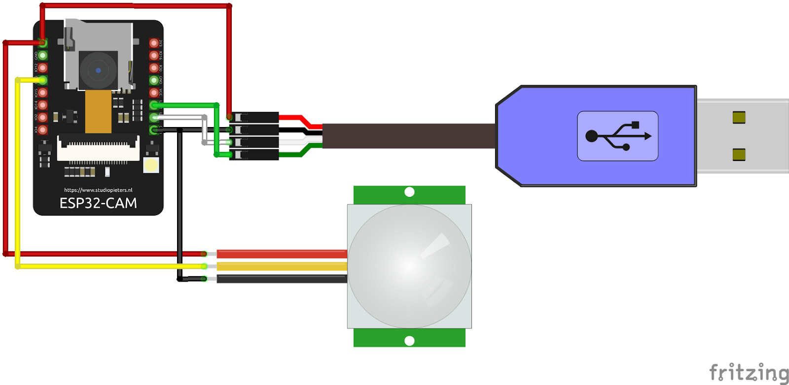

# Motion activated photo capture with ESP32-CAM, PIR sensor, and MQTT

[Making a motion triggered camera shot with ESP32-CAM and publishing it to the flespi MQTT broker.](https://flespi.com/blog/esp32-cam-motion-triggered-photo-mqtt)



------
## Configuration

Wi-Fi hotspot access credentials:

```
const char* ssid = "YOUR_WIFI_SSID";
const char* password = "YOUR_WIFI_PASSWORD";
```

MQTT broker credentials:

```
const char* mqtt_server = "mqtt.flespi.io";
const int mqtt_port = 1883;
const char* mqtt_user = "YOUR_FLESPI_TOKEN"; // replace with your own flespi token
const char* mqtt_password = "";
```

Specify the topic to which the shots will be published:

```
const char* mqtt_TopicName = "esp32/photo_1";
```

If you want a motion-triggered mode, change the value in the following line to 0:

```
#define SLEEP_DELAY 60000 // Delay for 60 Sec, 0 sec - PIR sensor mode
```
